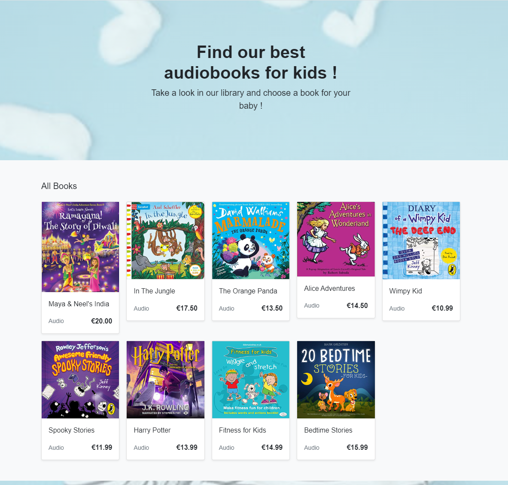
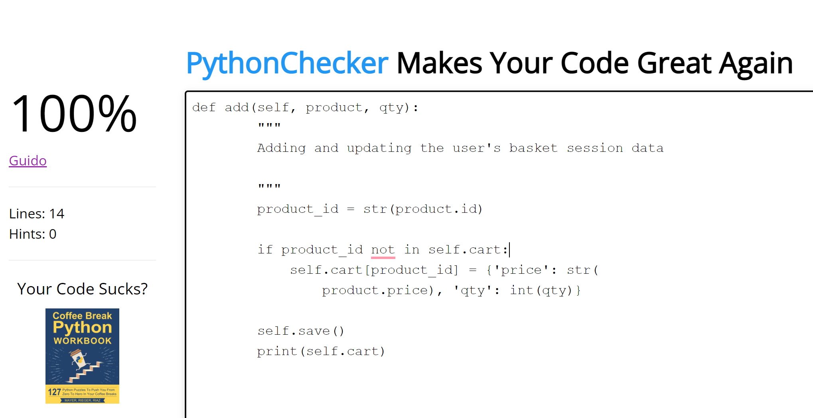

# Table of Contents
- [Table of Contents](#table-of-contents)
  - [Introduction](#introduction)
  - [UX ](#ux-)
    - [User Stories](#user-stories)
    - [Strategy](#strategy)
    - [Scope](#scope)
  - [Typography ](#typography-)
  - [Color ](#color-)
  - [Skeleton](#skeleton)
    - [Wireframes](#wireframes)
    - [Mobile](#mobile)
    - [Desktop](#desktop)
  - [Database Schema](#database-schema)
    - [Features](#features)
      - [Existing Features (Photo Links)](#existing-features-photo-links)
      - [Navbar](#navbar)
      - [Homepage](#homepage)
      - [Footer](#footer)
      - [Pay form Page](#pay-form-page)
      - [Register as a User](#register-as-a-user)
      - [Product Page](#product-page)
    - [Future Features](#future-features)
      - [Model of payment based on subscriptions](#model-of-payment-based-on-subscriptions)
      - [Chat window](#chat-window)
      - [Wishlist](#wishlist)
- [SEO ?????????????????????????????](#seo-)
- [Social Media](#social-media)
- [Email Marketing ????????????](#email-marketing-)
    - [Testing](#testing)
    - [Testing User Stories from User Experience (UX) Section](#testing-user-stories-from-user-experience-ux-section)
      - [Functionality Testing](#functionality-testing)
    - [Deployment](#deployment)
      - [Deploy to Heroku](#deploy-to-heroku)
    - [Credits](#credits)
      - [Media](#media)
      - [Code](#code)
      - [Footer](#footer-1)
    - [Structure](#structure)
        - [Programming Languages](#programming-languages)
      - [Technology Used ????????????????](#technology-used-)
      - [Frameworks, Libraries \& Programs Used](#frameworks-libraries--programs-used)
      - [Acknowledgements](#acknowledgements)

**[LIVE DEMO - Click Here](https://audio-bebe-books.herokuapp.com/)**

## Introduction

  Audio Bebe Books store specializes in improving kids behaviour and marketing audio books.
This is an e-commerce application for business-to-consumer transactions. The checkout process is very streamlined and easy to use, and encourages users to purchase. Checkout a single payment model.
Due to the fact that it sells digital products, customers have instant access to their purchases once their payment is successful. The Dashboard will be accessible to logged-in users.
Audio Bebe Books is primarily intended for kids who like to listen to stories:

## UX 

  ### User Stories

  User story format/steps has been taken from Boutique Ado and imported from Repository ecommerce2 (a test for my project) and more issues have been resolved manually during the project.
  
   - <a href=https://github.com/users/MariusBujor/projects/5/views/1 target='_blank'>Account Creation</a>

- VIEWING AND NAVIGATION
  - <a href= https://github.com/MariusBujor/ecommerce2/issues/10 target='_blank'>As a shopper, I want to view items in my bag to be purchased so I can identify the total cost of my purchase and all items I will receive.</a>
  - <a href=https://github.com/MariusBujor/ecommerce2/issues/13 target='_blank'>As a shopper, I want to view orders and confirmation after checkout so I can verify that I haven't made any mistakes.</a>
  
- REGISTRATION AND USER ACCOUNTS
  - <a href=https://github.com/MariusBujor/ecommerce2/issues/4 target='_blank'>As a user, I want easily register for an account so I can have personal account information.</a>
  - <a href= https://github.com/MariusBujor/ecommerce2/issues/6 target='_blank'>As a user, I want to easily recover my password in case I forgot it so I can recover access to my account.</a>
  - <a href= https://github.com/MariusBujor/ecommerce2/issues/5 target='_blank'>Log In / Log Out  As a user,   I want to easily log in or log out so I can access my personal account details.</a>
  - <a href= https://github.com/MariusBujor/ecommerce1/issues/6 target='_blank'>As a shopper, I can change my account user details(name) so I can pay with another card without problems.</a>
  - <a href=https://github.com/MariusBujor/ecommerce1/issues/7 target='_blank'>As a shopper, I can delete my account and details if I don't want to use the website or if my details to not kept in the database.</a>
  - <a href=https://github.com/MariusBujor/ecommerce1/issues/8 target='_blank'>As a Shopper, I can receive an email of confirmation when I am resetting my password so that I know that my new password is active and has been changed successfully.</a>
  - <a href=https://github.com/MariusBujor/ecommerce2/issues/8 target='_blank'>As a user, I want to have a personalized user profile so I can view my personal order history and order confirmations and save my payment information.</a>
  - <a href=https://github.com/MariusBujor/ecommerce2/issues/14 target='_blank'>As a shopper, I want to receive an email confirmation after checking out so I can keep the confirmation of what I've purchase for my records.</a>
    
- SORTING AND SEARCHING
  - <a href=https://github.com/MariusBujor/ecommerce1/issues/2 target='_blank'>As a shopper, I can choose the category that I want to see and the group of products I am interested <a>
  - <a href=https://github.com/MariusBujor/ecommerce2/issues/9  target='_blank'>As a shopper, I want to sort the list of available products so I can easily categorically sort products.</a>
  
- PURCHAING AND CHECKOUT
  - <a href= https://github.com/MariusBujor/ecommerce2/issues/11 target='_blank'>As a shopper, I want to adjust the number of individual items in my bag so I can easily make changes to my purchase before checking out.</a>
  - <a href=https://github.com/MariusBujor/ecommerce1/issues/4 target='_blank'>As a shopper, I can delete items from my basket so that I can buy only the items that I need.</a>
  - <a href=https://github.com/MariusBujor/ecommerce1/issues/5 target='_blank'>As a shopper I can press the delete button so that I can have the final price after I had deleted an item in my cart/basket.</a>
  
- ADMIN AND STORE MANAGEMENT
  - <a href= https://github.com/MariusBujor/ecommerce2/issues/15 target='_blank'>As a site owner, I want to add a product so I can add new items to my store.</a>
  - <a href=https://github.com/MariusBujor/ecommerce2/issues/16 target='_blank'>As a store owner, I want to edit/update a product so I can change product prices, descriptions, images, and other product criteria.</a>
  - <a href=https://github.com/MariusBujor/ecommerce2/issues/17 target='_blank'>As a shop owner, I want to delete a product so I can remove items that is no longer for sale.</a>
   
  
  ### Strategy

  - This is a website where users that love audio books can play them to their kids : 
  - Users that have kids
   ### Scope
   - The website provides for the user an easy navigation , photos,content,filter and prices with regards the books.

## Typography 

  - For typography has been used <a href=https://fonts.google.com/specimen/Roboto
 target='_blank'> Google Fonts Roboto</a>

## Color 

  - Colors have been imported from  <a href= https://color-hex.org/ target='_blank'> Color Hex</a>

   

## Skeleton

   ### Wireframes 
  - Wireframes created with Balsamiq
   - The project was developed from initial wireframes, and some modifications were made during the development process in response to user feedback.
   

   
Click to see the Wireframes

   ### Mobile

   

   ### Desktop

   

   

## Database Schema

  

  ### Features

   - In my last project, I struggled greatly with feature creep, so I only implemented the features I decided on during the planning stages
   - There were times when I was tempted to add a new cool feature, such as a customer wishlist, customer reviews, or user book club groups. My original plan, however, is much stronger as a result of sticking to it.

   
   #### Existing Features (Photo Links)

   #### Navbar

   
   
  
   #### Homepage

   
   

   #### Footer
   

   #### Pay form Page
   

   #### Register as a User
   

   #### Product Page
   

   ### Future Features 

   #### Model of payment based on subscriptions

   - There would be substantial value in a monthly subscription that gives access to all books.

   #### Chat window

   - The availability of a real person or bot to answer customer questions in real-time.

   #### Wishlist
  
   - My original plans and user stories did not include this feature, so I decided not to include it in the project.

# SEO ????????????????????????????? 
video?

# Social Media
  - As part of the site's promotion, it has a Facebook business page
    

# Email Marketing ????????????
  - In the website's footer, users can sign up for an email newsletter. All admin emails include a convenient unsubscribe link. When the admin creates a new letter, a post_save Django signal sends it to everyone subscribed.

  ### Testing

  The project was manually tested by fallowing the steps :
  - Code was run trough the validator resulting no issues
  - Deploying the project from gitpod workspace trough Heroku
  - The site was also tested on I-Pad , I-Phone and Laptop.
  
  ### Testing User Stories from User Experience (UX) Section

  - All user stories in the list above has been tested and confirmed after implementation.
  
  #### Functionality Testing

* Lighthouse

     

* HTML

     

* CSS

     

* PEP8 - No bugs found
  

    
Click to see the Screenshots

  

  

  

  

  ### Deployment

  Local Deployment

   I used Gitpod to write the code for my project, with regular commits to document the creation process. For this project, I deployed it to Heroku and used "git push Heroku master" to ensure that my GitHub pushes were also pushed to Heroku.

  #### Deploy to Heroku

    To deploy this page to Heroku from its GitHub repository, the following steps were taken:

    Start by installing everything in the requirements.txt file.
    You should have the corect requirements.txt and Procfile before moving on with the deployment.
    Log in to Heroku apps
    On Heroku page go to dashboard then to the "New" menu and choose "Create new app"
    Create a unique name for your app , select your region and click "Create app".
    Now the new app's dashboard is opened. Click on the resources tab.
    Add the Heroku Postgres Add-on.
    Go to the settings tab and reveal the Config Vars and add :
    CLOUDINARY_URL
    DATABASE_URL
    SECRET_KEY
    Click on "Deploy" and select your deploy method and repository.
    Click "Connect" on selected repository
    Click "Deploy Branch" in the manual deploy section. -> Heroku will now deploy the App.
    Development Environment

    Create an env.py that contains these variables :
      - os.environ["DATABASE_URL"] = "postgres://....."
      - os.environ["SECRET_KEY"] = ".."
      - os.environ["CLOUDINARY_CLOUD_NAME"] = ".."
      - os.environ["CLOUDINARY_API_KEY"] = ".."
      - os.environ["CLOUDINARY_API_SECRET"] = ".."
      - os.environ["CLOUDINARY_URL"] = ".."
      - os.environ["DEVELOPMENT"] = "True"
    Create requirements.txt by typing in terminal :
    pip3 freeze --local > requirements.txt

 ### Credits

   #### Media

   - All images for the book  have been taken from  http://www.amazon.com
   - Cover image for the site has been taken from  https://www.centracare.com
   - All description content for the books has been taken from https://books.google.ie/books/about/

   #### Code 

   - Through this project, I relied heavily on tutorials and Bootstrap examples.

   Very Academy.

   - I found this bookstore walkthrough to be brilliant. I found it extremely helpful for making Django sites more dynamic. As a result of this tutorial, I learned how to make AJAX calls. I also learned a lot about database design and setting up a Stripe webhook.

   - [Codegrepper](https://www.codegrepper.com/code-examples/python/jinja+get+current+url+django) as a general resource.

   - [W3School](https://www.w3schools.com/) as a general resource.

   #### Footer

 ### Structure

  ##### Programming Languages 

  - Python
  - HTML
  - CSS
  
  #### Technology Used ????????????????

  Payments

- Payment functionality was implemented using the Stripe system. The system was set up using the Boutique Ado project and Stripe documentation.

- For testing the payment system, the following dummy details can be used: Card number: 4242 4242 4242 4242 Expiry: 04/24 CVC: 242

  - No auth: 4242424242424242

  - Auth: 4000002500003155

  - Error: 4000000000009995

  
  #### Frameworks, Libraries & Programs Used

  - [Balsamiq](https://balsamiq.cloud/) - Was used to create the wireframes
  - [Bootstrap](https://getbootstrap.com/) - Was used to contribute to responsiveness and styling of the site
  - [TinyJPG](https://tinyjpg.com/) - Was used to compress images before uploading
  - [GitHub](https://github.com/) - Holds the repository of my project, GitHub connects to GitPod and Heroku
  - [GitPod](https://gitpod.io/) - Connected to GitHub, GitPod hosted the coding space,
   allowing the project to be built and then committed to the GitHub repository.
  - [Heroku](https://heroku.com/) - Connected to the GitHub repository, Heroku is a cloud application platform used 
   to deploy this project so the backend language can be utilised/tested.
  - [Django](https://www.djangoproject.com/) - This framework was used to build the foundations of this project
  - [Gunicorn](https://gunicorn.org/) - Gunicorn is a pure-Python HTTP server for WSGI applications.
  - [DjDatabaseURL](https://pypi.org/project/dj-database-url/) - This allows you to utilize the 12factor inspired DATABASE_URL 
   environment variable to configure your Django application.
  - [Cloudinary](https://cloudinary.com/) - Used to store images online for the recipe posts.
  - [Summernote](https://summernote.org/) - Used to add a text area field to the admin setup to enable 
   a list of ingredients and method steps.
  - [GoogleFonts](https://fonts.google.com/) - Provide fonts for the website.
  - [FontAwesome](https://fontawesome.com/) - Was used for icons.
  - [AmIResponsive](https://ui.dev/amiresponsive) - To check if the site is responsive on different screen sizes.
  - [W3CMarkupValidator](https://jigsaw.w3.org/) - Was used to validate HTML.
  - [Coolors](https://color-hex.org/) - To make color palette

 
 #### Acknowledgements

  - First of all ,my mentor Martina Terlevic that deserves a big thank you for suport and guidance.
  - As usual the Slack crowd can't be thanked enough. Especially I like to thank to Daniel_C_5p and Paul Istratoaie  for a lot of tips and encouragement all through this project.

List Schema == -
Database Schema -
Cloudinary -
page 404 -
Testing ==?
Facebook ok?== -
mailchip ok..? -
messages ???? -
robots.txt -
sitemap.xml file.  -

text in  orders views.py and stripe api key / base.css /  account-registration - activation invalid message / base html top links / 

   